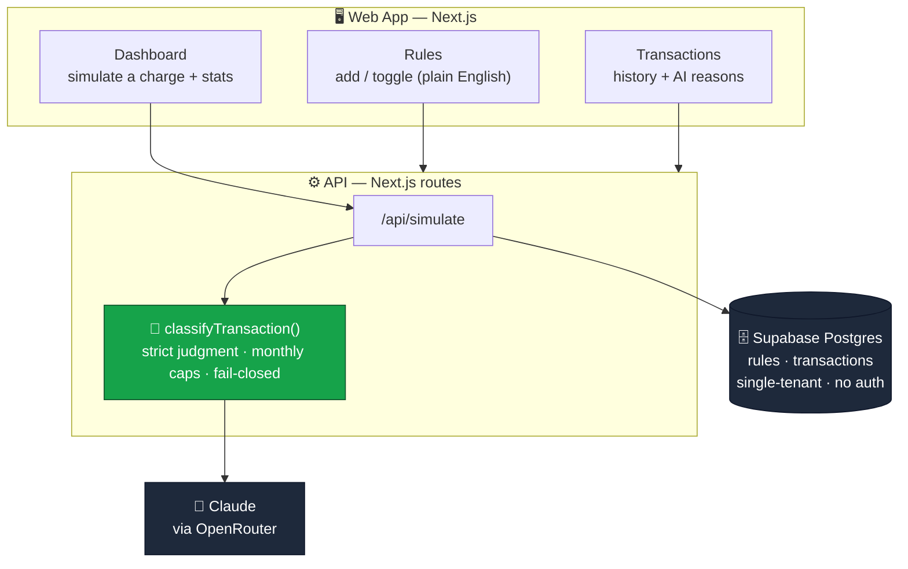
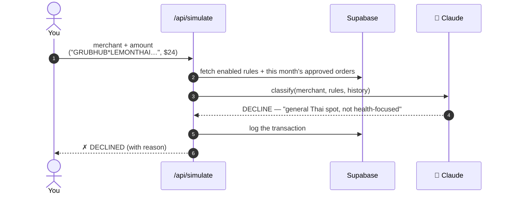
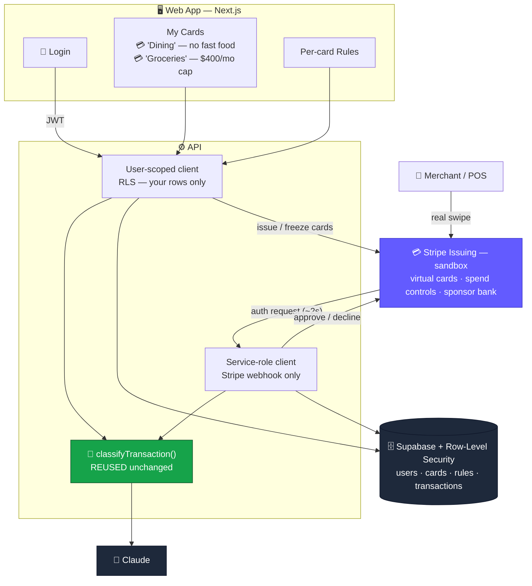
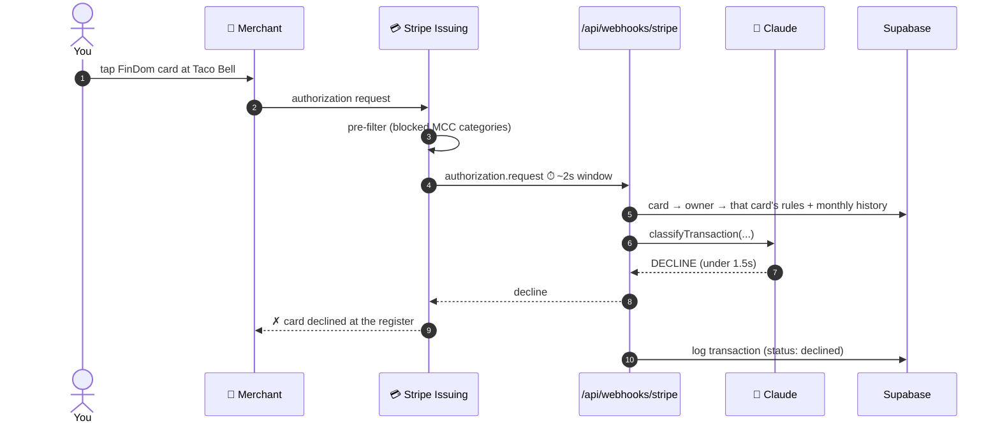
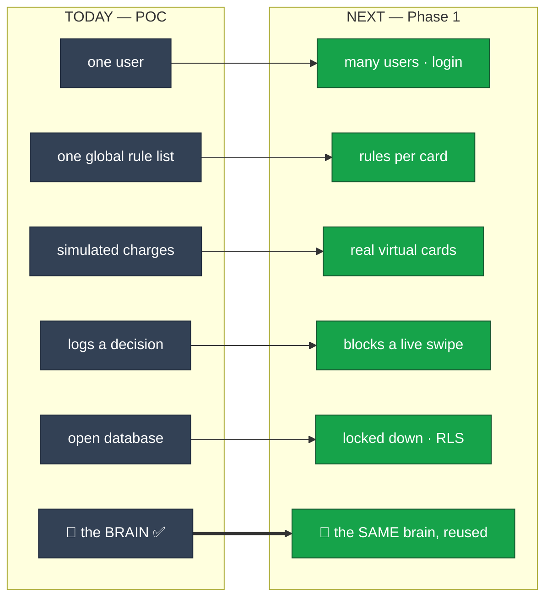
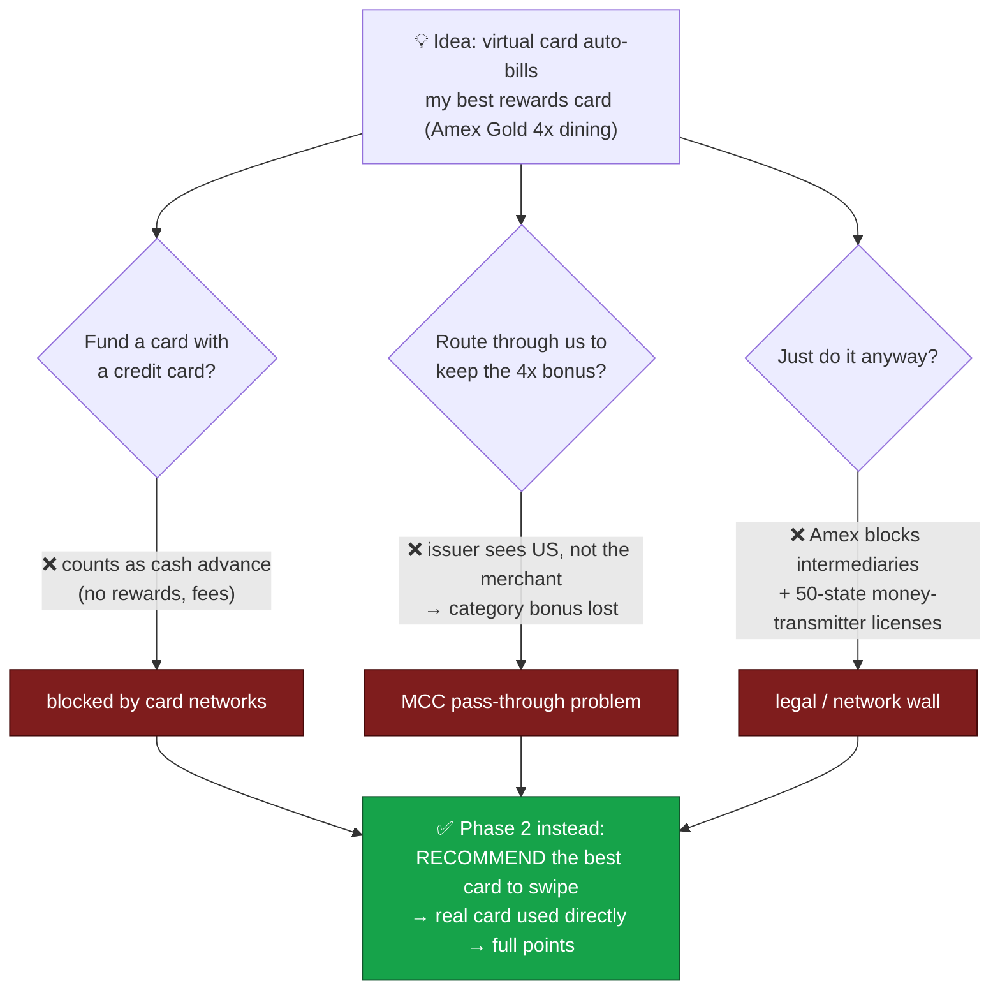

# FinDom — Presentation Diagrams

These are **Mermaid** diagrams — they render as real graphics, not ASCII.

**How to show them:**
- **GitHub** renders them automatically when you view this file.
- **Export for slides:** paste any block into [mermaid.live](https://mermaid.live) → Actions → download **PNG** or **SVG**.
- **VS Code:** install the "Markdown Preview Mermaid Support" extension.

---

## 1. What's built today (POC)

**One-liner for the slide:** *A working app where you write spending rules in plain English and an AI approves or declines transactions — proven today via a built-in simulator (no real money).*

---

## 2. How a decision works today

---

## 3. What we build next (Phase 1)

**One-liner for the slide:** *Same brain — now wrapped in real accounts, real virtual cards, and real-time blocking of an actual swipe.*

---

## 4. How a decision works next (real-time, blocks the swipe)

---

## 5. The evolution (one-slide story)

**The pitch:** *We've already de-risked the hard part — does AI judgment on real transactions actually work? It does. Everything next is integration, not invention.*

---

## 6. Why not "auto-bill my best rewards card"? (the honest slide)

---

_Companion docs: [`CURRENT_VS_NEXT.md`](./CURRENT_VS_NEXT.md) · [`PHASE1_DESIGN.md`](./PHASE1_DESIGN.md) · [`MVP_ARCHITECTURE.md`](./MVP_ARCHITECTURE.md)_
