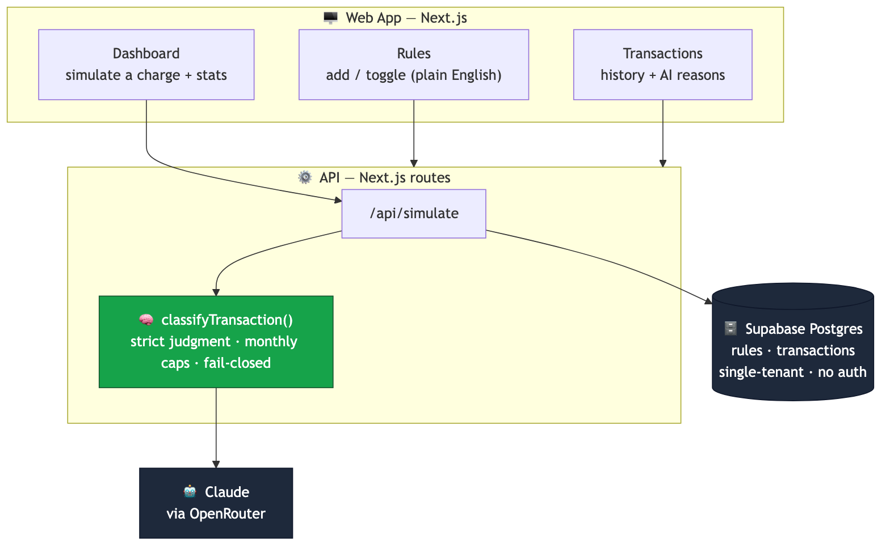
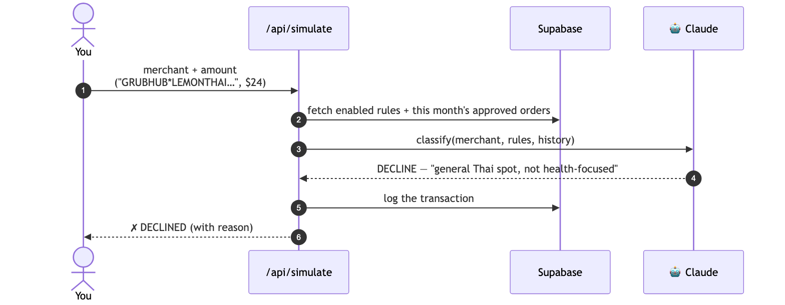
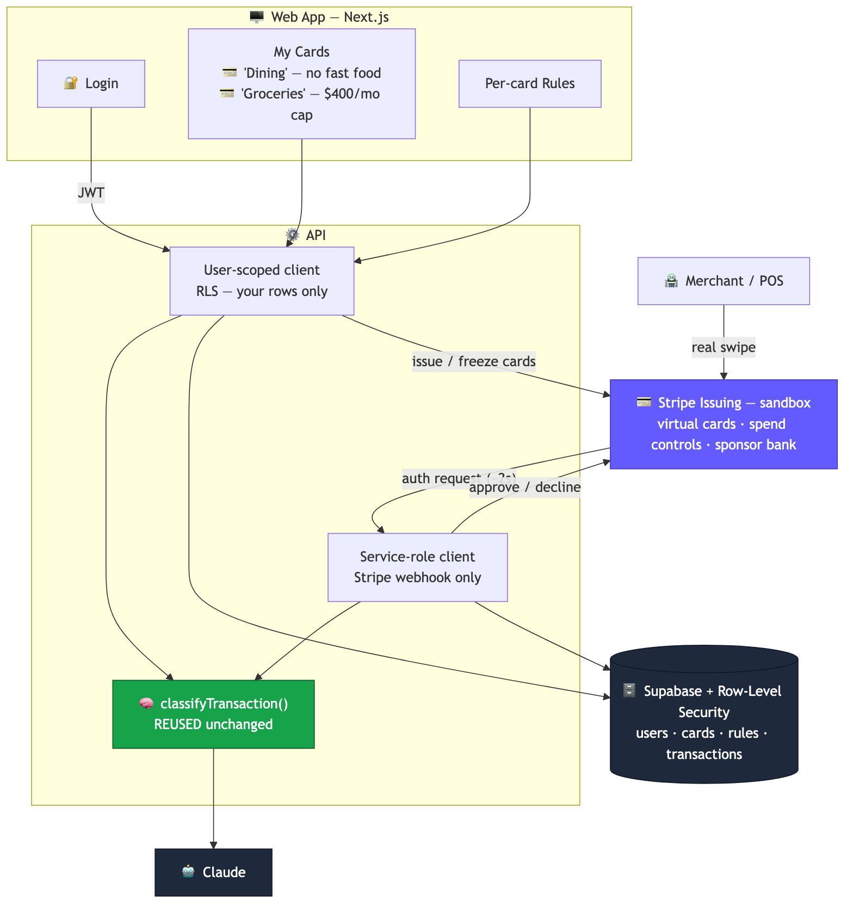
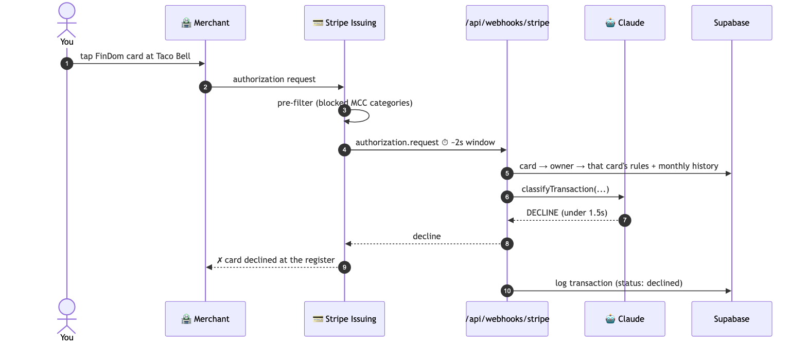
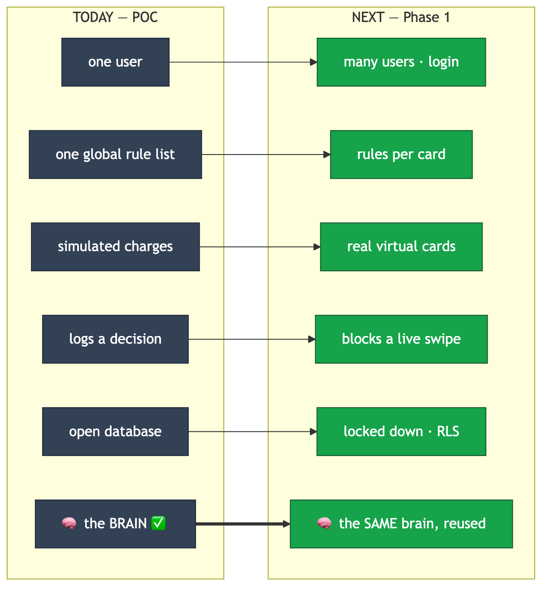
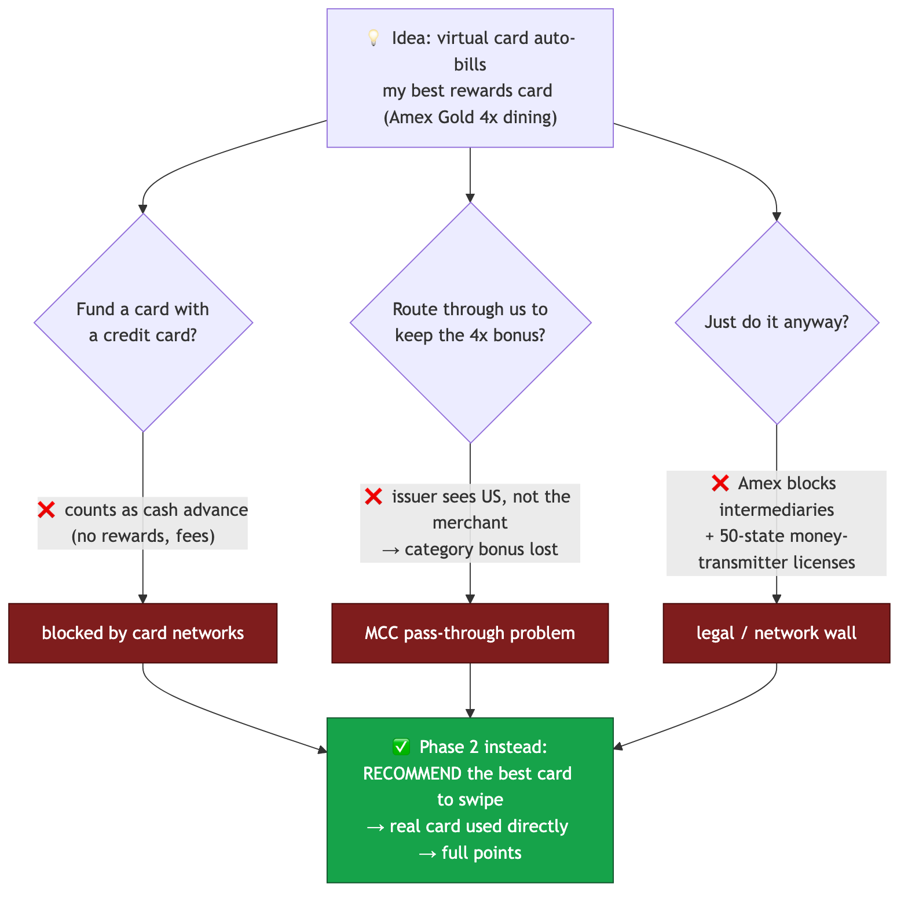

# FinDom — Rendered Diagrams

Presentation-ready images. Each diagram has a **`.png`** (white background, 2× resolution — drop into slides), an **`.svg`** (transparent, scales infinitely), and the **`.mmd`** Mermaid source (edit + re-render).

To re-render after editing a `.mmd`:
```bash
npx mmdc -i docs/diagrams/<name>.mmd -o docs/diagrams/<name>.png -b white -s 2
```

---

## 1. What's built today (POC)


## 2. How a decision works today


## 3. What we build next (Phase 1)


## 4. How a decision works next (blocks a live swipe)


## 5. The evolution (one-slide story)


## 6. Why not "auto-bill my rewards card" (the honest slide)


---

### Suggested 3-slide pitch flow
1. **Diagram 5** (evolution) — the whole story in one frame
2. **Diagrams 1 + 3** side by side — "today vs next, same brain"
3. **Diagram 4** (real-time block) — the wow moment: it declines a live swipe
